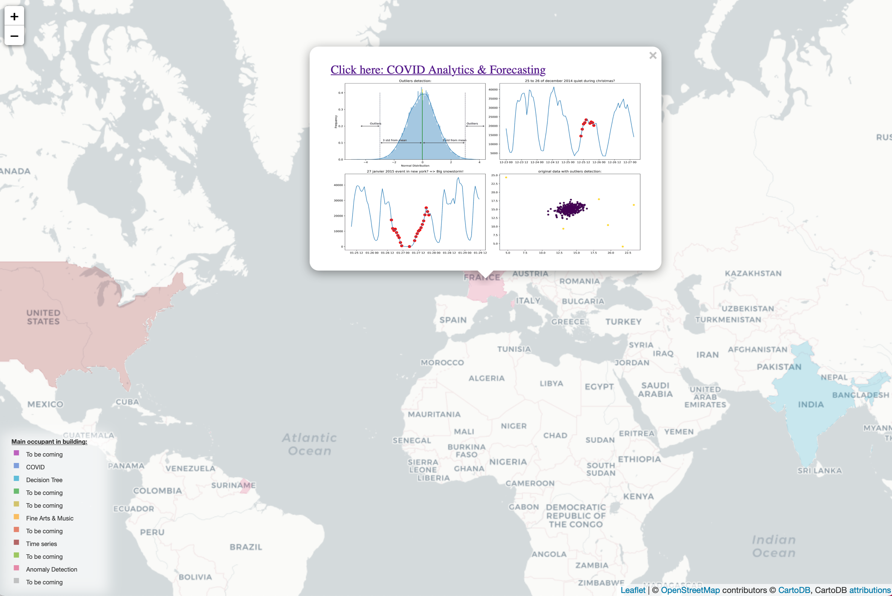

Data science and analytics project portfolio:

<!--  -->

<iframe src="./images/map.html" target="_blank" height="550" width="100%"> display </iframe> 

[Wordwide COVID-19 Analytics & Forecasting](https://virus-corona.herokuapp.com)

This dashboard contains a comprehensive overview of the progression of Coronavirus COVID-19 spread. The COVID-19 data is updated once a day around 05:00 (UTC) - 3pm in Australia and 7am in France.

[Anomaly detection](https://github.com/loulouOz/Anomaly-Detection/blob/main/Anomaly%20detection%20using%20Z%20score.ipynb)

Anomaly/Outliers detection using Z-score for time series and 2d data.

[Predicting price of diamonds](https://github.com/loulouOz/Predicting-diamond-price/blob/main/Diamonds_Decision_Tree.ipynb)

Classification using decision tree and gridsearch to predict price of diamonds.

[Time series Forecasting](https://github.com/loulouOz/Time-Series-Forecasting/blob/main/time_series_forecasting.ipynb)

Time series Forecasting using XGBoost and gridsearch on New York city taxi dataset.

